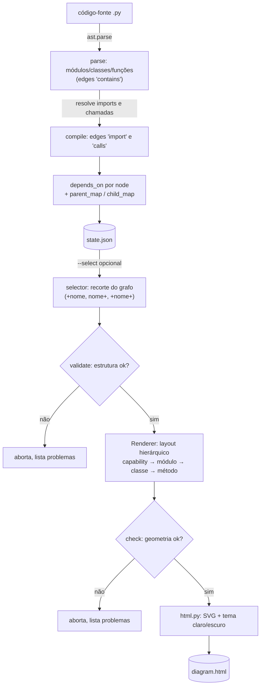
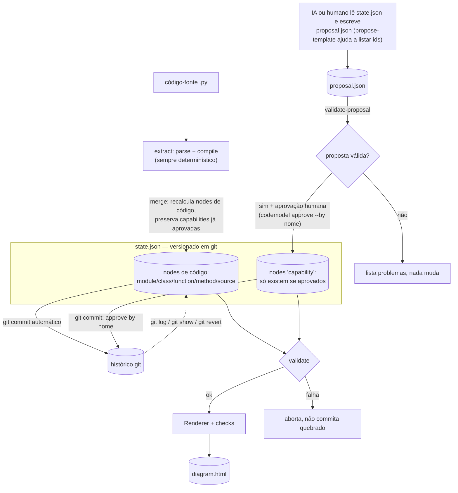

# codemodel-cli

Prova de conceito: código-fonte tratado como modelo, com extração
determinística (à la dbt), renderização validada (à la Archify), e uma
camada de funcionalidade percebida pelo usuário — proposta por IA/humano,
aprovada por humano, versionada em git.

```
código-fonte (.py) --[parse+compile]--> state.json --[validate→render→check]--> diagrama (HTML/SVG)
```

## Pipeline



## Capabilities: proposta → aprovação → git

O extractor é determinístico e decompõe código por **estrutura de
arquivo** (módulo → classe → função) — uma fronteira de implementação
que quase nunca bate com o que o usuário percebe como "uma
funcionalidade". Uma `capability` é uma camada por cima disso: agrupa
nodes de código existentes sob um nome e descrição do ponto de vista de
quem usa o sistema. Como isso é julgamento (não algo verificável
estaticamente), ela nunca é gerada pelo extractor — só entra no estado
depois de proposta e aprovação explícita, e o extractor nunca a apaga
numa reextração seguinte.



## Instalação

Sem dependências externas além do binário `git` (opcional — se ausente,
os comandos de versionamento avisam e seguem sem quebrar o resto do
pipeline). Requer Python 3.10+.

```bash
cd codemodel-cli
pip install -e .        # instala o comando `codemodel`
```

## Uso

```bash
# pipeline completo: extract -> validate -> render -> check (+ git commit)
codemodel run examples/sample_app --state state.json --out diagram.html

# passo a passo
codemodel extract examples/sample_app --out state.json   # parse+compile, preserva capabilities, comita
codemodel validate state.json
codemodel render state.json --out diagram.html
codemodel view state.json --out index.html        # viewer interativo (Cytoscape.js autocontido)
codemodel show state.json

# recorte estilo dbt (nome | +nome | nome+ | +nome+); funciona também
# com o nome de uma capability, trazendo tudo que ela agrupa
codemodel show state.json --select "Gestão de pedidos"

# --- camada de capability (funcionalidade percebida) ---
codemodel propose-template state.json --out proposal.json   # lista candidatos, você/a IA preenche 'capabilities'
codemodel validate-proposal proposal.json --state state.json
codemodel approve proposal.json --state state.json --by "andre"

# --- git ---
codemodel snapshot state.json -m "mensagem manual"   # extract/approve já comitam sozinhos (--no-git desliga)
```

### Formato de uma proposta (`proposal.json`)

```json
{
  "proposed_by": "ai",
  "capabilities": [
    {
      "slug": "gestao_de_pedidos",
      "name": "Gestão de pedidos",
      "description": "Criar e consultar pedidos — uma jornada só, do ponto de vista do usuário.",
      "groups": ["module.sample_app.service", "module.sample_app.repository", "function.sample_app.main.executar"],
      "rationale": "A separação em arquivos é detalhe de implementação (domínio vs dados), não uma fronteira que o usuário percebe."
    }
  ]
}
```

`codemodel propose-template` gera o esqueleto com `candidates` (todos os
ids de código disponíveis) pronto — quem preenche `capabilities` é uma IA
lendo o código (ou um humano), nunca a extração em si.

## O que vem de cada referência

### Do dbt (`docs.getdbt.com`)

- **`unique_id` `<resource_type>.<project>.<nome>`** e **`depends_on`
  dentro de cada node** — mesmo esquema do manifest.json.
- **`parent_map`/`child_map` pré-computados** — igual ao manifest, para
  navegação do DAG sem recalcular a partir dos edges.
- **Duas fases `parse` → `compile`** — mesma ordem e mesmo motivo do dbt
  (uma referência pode apontar pra algo só conhecido depois que todo o
  projeto foi parseado).
- **Seletor `+nome+`** (`dbt run --select`) — implementado em
  `selector.py`, estendido aqui pra também expandir por `capability`.
- **Exposures** (`docs.getdbt.com/reference/exposure-properties`) — o
  modelo direto da `capability`: declaradas à mão (nunca inferidas do
  código), com `depends_on` apontando pra nodes existentes, documentando
  como o sistema é consumido "por fora". A diferença deliberada daqui: o
  dbt não exige aprovação pra uma exposure existir (é só declarada em
  YAML e versionada como o resto do projeto); aqui exigimos, porque a
  entrada é uma IA analisando código e propondo agrupamento — julgamento
  que vale a pena confirmar antes de virar parte do estado.
- **Simplificação assumida**: no dbt, `exposures` é uma chave de topo
  *separada* de `nodes` no manifest. Aqui, `capability` é só mais um
  `resource_type` dentro de `nodes` — mais simples de implementar (todo
  o `renderer`/`selector`/`validate` já sabe lidar com `nodes` genérico),
  a garantia de "nunca gerado pelo parser" vem da disciplina do merge em
  `cli.py::_extract_and_merge`, não de uma separação estrutural no JSON.

### Do Archify (`github.com/tt-a1i/archify`)

- **Pipeline Generate → Validate → Render → Check** — `validate.py` roda
  antes de desenhar, `checks.py` roda depois; qualquer falha aborta a
  entrega, sem gerar artefato quebrado.
- **Saída autocontida** — HTML com SVG embutido e tema claro/escuro
  (`html.py`), default de `render`/`run` (`--format svg` continua
  disponível).
- **"Cards" de resumo** — cabeçalho com projeto/contagens desenhado no
  próprio diagrama.

O que **não** foi trazido do Archify real: geração de IR por linguagem
natural via agente (aqui a extração de código é sempre determinística),
busca/rastreio de rota em JS interativo, Architecture Delta (diff entre
snapshots — git cumpre parte desse papel aqui, mas sem visualização),
evidência pinada a commit Git específico por node.

## O que vai para o estado (state.json)

```json
{
  "metadata": { "project": "sample_app", "node_count": 18, "edge_count": 24, ... },
  "nodes": {
    "module.sample_app.service": { "resource_type": "module", "depends_on": [...], ... },
    "capability.sample_app.gestao_de_pedidos": {
      "resource_type": "capability", "name": "Gestão de pedidos",
      "depends_on": ["module.sample_app.service", "module.sample_app.repository", "function.sample_app.main.executar"],
      "origin": {"proposed_by": "ai", "approved_by": "andre", "approved_at": "...", "rationale": "..."}
    }
  },
  "edges": [
    { "source": "module.sample_app.service", "target": "module.sample_app.repository", "type": "import" },
    { "source": "capability.sample_app.gestao_de_pedidos", "target": "module.sample_app.service", "type": "groups" }
  ],
  "parent_map": { ... }, "child_map": { ... }
}
```

`resource_type` distingue **module/class/function/method** (código —
sempre dono do extractor), **source** (import externo, não analisado) e
**capability** (funcionalidade percebida, sempre dona do fluxo
propose→approve, nunca do extractor). `edges.type` é `contains`
(estrutura), `import`/`calls` (dependência real de código, presente em
`parent_map`/`child_map`) ou `groups` (capability → código que ela
agrupa — fora do DAG de código, mas navegável via `--select`).

## Limitações conhecidas (é uma POC, não uma ferramenta de produção)

- só Python, só análise estática via `ast`;
- resolução de `calls` é heurística (nome simples, `self.metodo()`,
  `alias.funcao()` de import conhecido) — chamadas indiretas não são
  capturadas;
- layout do diagrama é um fluxo simples com wrap, sem hierarquia/zoom
  pra bases de código grandes;
- `validate.py`/`checks.py` cobrem só as invariantes que este projeto
  precisa manter, não um schema formal nem checagem de rotas;
- `capability` é `resource_type` dentro de `nodes`, não uma chave de
  topo separada como as `exposures` do dbt (ver acima);
- o git em `versioning.py` é mínimo: `init`/`add`/`commit` num único
  arquivo. Sem branch, sem resolução de conflito, sem diff estruturado
  entre versões do estado (`git diff state.json` funciona, mas mostra
  diff textual de JSON, não um diff semântico de nodes/edges).

---

## Guia de implementação para uma IA (ex.: Claude Code) rodando neste computador

Dirigida a um assistente de IA que vá configurar, rodar, estender — ou
**propor capabilities** — neste projeto localmente.

### 1. Setup mínimo

```bash
cd codemodel-cli
pip install -e .
codemodel run examples/sample_app --state /tmp/state.json --out /tmp/diagram.html
```

### 2. Onde cada responsabilidade mora

| Arquivo                   | Responsabilidade                                                              |
|-----------------------------|-----------------------------------------------------------------------------|
| `codemodel/ids.py`          | esquema de `unique_id` estilo dbt (inclui `capability_id`)                  |
| `codemodel/extractor.py`    | código-fonte -> nodes/edges/parent_map/child_map (parse + compile). **Nunca toca em `capability`.** |
| `codemodel/proposal.py`     | template de proposta, validação, fusão de `capability` aprovada no estado   |
| `codemodel/versioning.py`   | git mínimo (`init`/`add`/`commit`, mensagem automática por diff de contagem) |
| `codemodel/selector.py`     | seletor estilo dbt (`+nome+`), incluindo expansão por `capability`          |
| `codemodel/validate.py`     | validação estrutural do estado (inclui checagem de `capability`)            |
| `codemodel/state.py`        | serializar/desserializar JSON genérico no disco                             |
| `codemodel/renderer.py`     | `dict` -> SVG, com camada visual própria para `capability`                  |
| `codemodel/checks.py`       | checagem de geometria pós-layout                                            |
| `codemodel/html.py`         | empacota o SVG num HTML autocontido com tema claro/escuro                   |
| `codemodel/cli.py`          | orquestra os módulos acima; `_extract_and_merge` é onde mora a regra "capability sobrevive à reextração" |

### 3. Se você (IA) for propor uma capability

1. Rode `codemodel propose-template state.json --out proposal.json` pra
   ter a lista de ids disponíveis sem digitar na mão.
2. Leia o código de verdade (não só os nomes de módulo/classe) antes de
   agrupar — o objetivo é a fronteira que o *usuário* percebe, que
   frequentemente atravessa vários arquivos.
3. Preencha `capabilities` no proposal.json: `slug`, `name`,
   `description` (em linguagem de usuário, não de implementação),
   `groups` (ids de `candidates`) e `rationale` (por que esses ids
   formam uma coisa só, na perspectiva de quem usa).
4. Rode `codemodel validate-proposal` antes de pedir aprovação — corrija
   o que ela apontar.
5. **Não rode `approve` sozinha.** `approve` exige `--by` e representa
   uma decisão humana — apresente a proposta pra pessoa e deixe ela
   rodar o comando (ou confirmar explicitamente antes de você rodar por
   ela).

### 4. Como validar que uma mudança não quebrou nada

```bash
codemodel run examples/sample_app --state /tmp/state.json --out /tmp/diagram.html
codemodel show /tmp/state.json
```

`validate`/`check` saem com código 1 e listam problemas se algo quebrar
— pega a maioria das regressões sem precisar abrir o HTML. Pra mudanças
em `proposal.py`/`cli.py::_extract_and_merge`, teste também o ciclo
completo: aprovar uma capability, reextrair, confirmar que ela sobrevive
(`[merge] N capability(s) preservada(s)`); depois remover o código que
ela agrupa e confirmar que ela é descartada com aviso, não silenciosamente.

### 5. Contexto de por que este projeto existe

É uma prova de conceito isolada, sem credenciais/bancos/serviços
externos além do git local. O padrão de fundo — JSON canônico entre
etapas, com uma camada curada e aprovada por cima do que é determinístico
— é o mesmo que projetos maiores do autor já usam (ex.: domínio → C4 via
JSON canônico). Ao estender esta POC, preserve dois princípios: o estado
é sempre a fonte de verdade entre etapas, nunca descartável; e tudo que é
*interpretação* (capabilities) fica claramente separado, por autoria e
fluxo, do que é *fato extraído do código* — nunca os dois se misturam
silenciosamente no mesmo campo.
